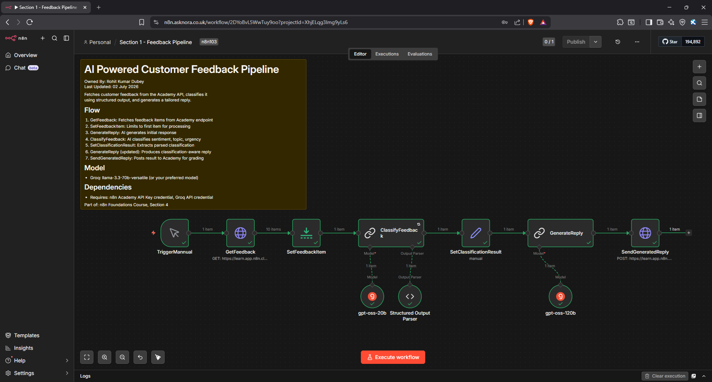

<div align="center">

<br />


<br />

[](./workflow/echodesk-workflow.json)
[](https://www.linkedin.com/in/rohitkumardubey)
[](https://n8n.io)
[](https://groq.com)

<br />

> **A fully automated AI workflow that reads incoming customer feedback across email and support channels, classifies it by sentiment, topic, and urgency using structured output, then generates a tailored, context-aware reply. No manual triage, no free-text guesswork.**

<br />

</div>

---

## Table of Contents

- [Situation](#-situation)
- [Task](#-task)
- [How It Was Built](#-how-it-was-built)
- [Result](#-result)
- [Tech Stack](#-tech-stack)
- [Architecture](#-architecture)
- [Workflow Paths](#-workflow-paths)
- [Prompt Engineering](#-prompt-engineering)
- [Structured Output and Retry Logic](#-structured-output-and-retry-logic)
- [Screenshots](#-screenshots)
- [Quick Start](#-quick-start)
- [Limitations](#-limitations)
- [Future Scope](#-future-scope)
- [Links](#-links)

---

## 🔍 Situation

Sales operations teams receiving customer feedback across multiple channels face a recurring bottleneck. Every message has to be read, categorised, and matched to a response by hand. Sentiment, topic, and urgency get judged inconsistently from one reviewer to the next, and a piece of positive feedback often receives the same turnaround as a high-urgency billing complaint.

Free-text AI responses do not solve this on their own. A paragraph of AI-generated analysis still needs to be manually parsed before it can drive routing, reporting, or prioritisation, which defeats the purpose of automating the step in the first place.

---

## 🎯 Task

Build a production-ready automated pipeline that could:

- **Fetch** customer feedback from a live endpoint across multiple channels
- **Classify** each item by sentiment, topic, urgency, and key issue in a consistent, machine-readable format
- **Validate** the classification against a defined schema, with automatic retry if the model output does not conform
- **Generate** a reply that adapts its tone and next steps to the classification, rather than a generic acknowledgement
- **Deliver** the structured result and generated reply back to the source system for logging and grading

---

## ⚙️ How It Was Built

The entire workflow was built in **n8n**, with **Groq** handling all AI processing across two purpose-matched models that feed into a single output pipeline.

### System Flow

```
Customer Feedback (API)
           │
           ▼
    [ GetFeedback ] ── authenticated GET request
           │
           ▼
   [ SetFeedbackItem ] ── limits to one item for processing
           │
           ▼
 [ ClassifyFeedback ]
 Model: gpt-oss-20b
 Structured Output Parser
 Retry on Fail, 3 attempts
           │
           ▼
 [ SetClassificationResult ]
 extracts sentiment, topic, urgency, key issue
           │
           ▼
 [ GenerateReply ]
 Model: gpt-oss-120b
 Tone adapts to sentiment and urgency
           │
           ▼
  [ SendGeneratedReply ] ── posts result back to API
```

### Key Engineering Decisions

- **Two models, two jobs.** Classification is a simpler, well-bounded task and runs on a smaller, faster model, gpt-oss-20b. Reply generation needs more nuance and runs on a larger model, gpt-oss-120b. Matching model size to task complexity keeps cost down without sacrificing output quality.
- **Structured Output Parser over free-text parsing.** Asking the model to write a paragraph and then regex-parsing it out is fragile. Defining a JSON schema up front and validating against it makes the output directly usable by downstream nodes.
- **Retry on Fail as a safety net.** LLM output occasionally breaks schema even with a parser in place. Three retries with a short wait between attempts resolves the majority of malformed responses without failing the whole run.
- **Classification feeds generation.** Reply drafting is not treated as an isolated step. Sentiment, topic, and urgency are passed into the reply prompt, so tone and next steps are grounded in the actual analysis rather than guessed at generically.
- **Header Auth for endpoint access.** Both the feedback source and the reply submission endpoint are authenticated through a shared API key credential plus a per-request assessment ID header, keeping credentials centralised and reusable across nodes.

---

## 📊 Result

| Metric | Outcome |
|---|---|
| Feedback channels supported | Email, support ticket |
| Classification fields | Sentiment, topic, urgency, key issue |
| Classification model | openai/gpt-oss-20b (via Groq) |
| Reply generation model | openai/gpt-oss-120b (via Groq) |
| Output validation | Structured Output Parser with 3x retry on failure |
| Manual triage required | None |
| Reply tone | Adapts automatically to sentiment and urgency |

---

## 🛠 Tech Stack

<div align="center">

| Layer | Technology |
|---|---|
| Orchestration |  |
| AI Provider |  |
| Classification Model |  |
| Generation Model |  |
| Authentication |  |
| Data Source |  |

</div>

---

## 🏗 Architecture

```
┌──────────────────────────────────────────────────────────┐
│              Customer Feedback Source (API)               │
│           Email and support ticket channels                │
└───────────────────────┬──────────────────────────────────┘
                         │
                         ▼
┌──────────────────────────────────────────────────────────┐
│                        n8n                                 │
│                                                              │
│   GetFeedback → SetFeedbackItem                             │
│                                                              │
│   ClassifyFeedback (gpt-oss-20b + Structured Output Parser) │
│                          │                                   │
│                SetClassificationResult                       │
│                          │                                   │
│         GenerateReply (gpt-oss-120b, tone-adaptive)          │
│                          │                                   │
│                  SendGeneratedReply                          │
└───────────────────────┬──────────────────────────────────┘
                         │
                         ▼
┌──────────────────────────────────────────────────────────┐
│         Structured classification and reply delivered      │
│              back to the feedback processing API           │
└──────────────────────────────────────────────────────────┘
```

---

## 🔀 Workflow Paths

### Path A, Classification (gpt-oss-20b)

Handles sentiment, topic, urgency, and key issue extraction. Output is validated against a fixed JSON schema through the Structured Output Parser, with retry on failure configured to catch the occasional malformed response from the smaller model.

### Path B, Reply Generation (gpt-oss-120b)

Runs after classification completes and takes the classified fields as direct input. Tone is set conditionally: empathetic and apologetic for negative sentiment or high urgency, appreciative and warm for positive sentiment, with specific next steps offered for billing or support topics.

Both paths run in sequence within the same pipeline and share the same downstream delivery node.

---

## 🧠 Prompt Engineering

Five key decisions shaped the prompt design:

| Decision | Reason |
|---|---|
| Fixed category sets for sentiment, topic, and urgency | Prevents free-text drift and keeps output filterable and reportable |
| Explicit schema example embedded in the system message | Reinforces the Structured Output Parser and reduces malformed responses |
| One-sentence key issue summary | Gives a fast, human-readable snapshot without reproducing the full message |
| Classification passed into the reply prompt as context | Ties the reply's tone and content directly to the analysis rather than guessing at it |
| Reply length capped at 2 to 3 sentences | Keeps replies concise and appropriate for direct customer communication |

---

## 🛡 Structured Output and Retry Logic

Classification output is validated against a fixed JSON schema before it is allowed to move downstream:

```
sentiment  → positive | neutral | negative
topic      → billing | product | support | general
urgency    → low | medium | high
key_issue  → one-sentence summary
```

If the model returns output that fails to match this schema, the node retries automatically up to three times with a short delay between attempts, rather than failing the entire run. This keeps the pipeline resilient to the occasional malformed response that even a well-prompted, smaller model can produce.

---

## 📸 Screenshots

**n8n Workflow Canvas**



*The full pipeline: feedback retrieval, classification with structured output, and tone-adaptive reply generation, ending in a call back to the feedback API.*

---

## 🚀 Quick Start

### Prerequisites

- An n8n instance, cloud or self-hosted
- A Groq API key, available free at [groq.com](https://groq.com)
- Access credentials for the feedback source API

### 1. Import the Workflow

1. Open your n8n instance
2. Click the three dots menu (top right) and select **Import**
3. Select `workflow/echodesk-workflow.json` from this repository
4. Add your credentials: Header Auth (API key and assessment ID) and Groq API
5. Activate the workflow

### 2. Required Credentials

| Credential | Where to get it | Used in node |
|---|---|---|
| Header Auth (API key) | Feedback source provider | GetFeedback, SendGeneratedReply |
| Groq API key | [groq.com](https://groq.com) | ClassifyFeedback, GenerateReply |

---

## ⚠️ Limitations

| Limitation | Detail |
|---|---|
| Single item per run | The current version processes one feedback item at a time via the Limit node |
| Model determinism | Smaller models are more prone to schema-breaking output, mitigated by retry logic but not eliminated |
| Language support | Prompts are tuned for English feedback |
| Channel scope | Currently supports email and support ticket text, does not process voice or attachments |

---

## 🚀 Future Scope

- **Batch processing** to classify and reply to multiple feedback items per run
- **CRM integration** to log classification results directly against customer records
- **Priority routing** to escalate high-urgency, negative-sentiment feedback to a human agent
- **Multi-language support** for non-English feedback
- **Analytics dashboard** summarising sentiment and topic trends over time

---

## 🔗 Links

| Resource | URL |
|---|---|
| Workflow JSON | [Download and import](./workflow/echodesk-workflow.json) |
| Groq | [groq.com](https://groq.com) |
| n8n Documentation | [docs.n8n.io](https://docs.n8n.io) |
| Built by | [Rohit Kumar Dubey](https://www.linkedin.com/in/rohitkumardubey) |

---

<div align="center">


*Built by [Rohit Kumar Dubey](https://www.linkedin.com/in/rohitkumardubey) · Feedback and contributions welcome*

</div>
